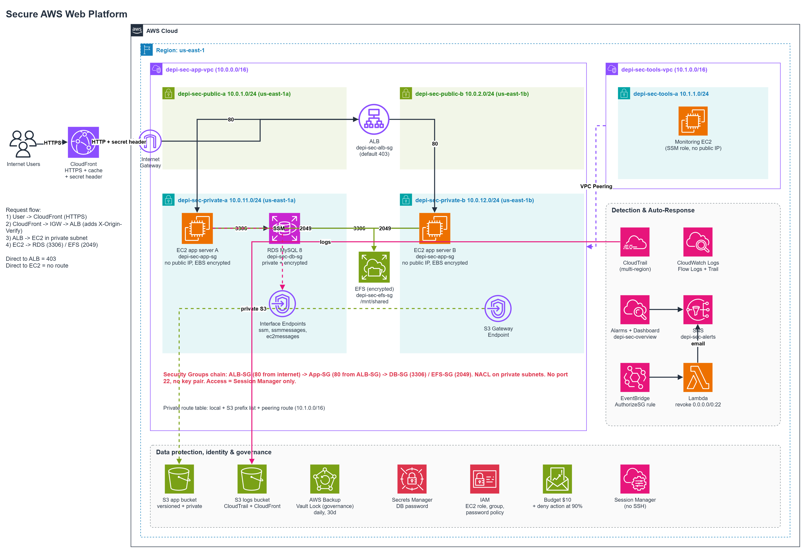

# Architecture

## Diagram

```
                                    INTERNET
                                        │
                                        │ HTTPS (443)
                                        ▼
                              ┌───────────────────┐
                              │    CloudFront      │  adds secret header
                              │  (edge, global)    │  X-Origin-Verify
                              └─────────┬──────────┘
                                        │ HTTP (80) + header
                                        ▼
        ═══════════════════════ depi-sec-app-vpc (10.0.0.0/16) ═══════════════════════
        ║                                                                            ║
        ║   PUBLIC SUBNETS (route to Internet Gateway)                              ║
        ║   ┌─────────────────────┐        ┌─────────────────────┐                  ║
        ║   │ public-a (10.0.1.0)  │        │ public-b (10.0.2.0)  │  us-east-1a/b   ║
        ║   │   Application Load   │◄──────►│   Balancer (both AZs)│                  ║
        ║   │   Balancer           │        │                      │                  ║
        ║   └──────────┬───────────┘        └──────────┬───────────┘                  ║
        ║              │ listener rule: forward only if header matches                ║
        ║              │ (default action = 403 Forbidden otherwise)                   ║
        ║   ───────────┼──────────────────────────────┼─────────────────────────────  ║
        ║   PRIVATE SUBNETS (no route to internet)                                    ║
        ║              ▼                              ▼                              ║
        ║   ┌─────────────────────┐        ┌─────────────────────┐                  ║
        ║   │ private-a (.11.0)    │        │ private-b (.12.0)    │                  ║
        ║   │  EC2 app-a (nginx-   │        │  EC2 app-b           │                  ║
        ║   │  free python server) │        │                      │                  ║
        ║   └──────────┬───────────┘        └──────────┬───────────┘                  ║
        ║              │  mount -t nfs4                │  mount -t nfs4               ║
        ║              ▼                                ▼                             ║
        ║        ┌───────────────────────────────────────────┐                        ║
        ║        │   EFS (shared /app-data, encrypted)         │                        ║
        ║        └───────────────────────────────────────────┘                        ║
        ║              │  mysql :3306                                                  ║
        ║              ▼                                                               ║
        ║        ┌───────────────────────────────────────────┐                        ║
        ║        │   RDS MySQL (private-a, encrypted, no      │                        ║
        ║        │   public IP)                                │                        ║
        ║        └───────────────────────────────────────────┘                        ║
        ║                                                                              ║
        ║   VPC Endpoints (private subnets): S3 (gateway), SSM/SSMMESSAGES/            ║
        ║   EC2MESSAGES (interface) — management traffic never leaves the VPC          ║
        ║                                                                              ║
        ║   Peering ◄──────────────────────────────────────────────────┐              ║
        ═══════════════════════════════════════════════════════════════│══════════════
                                                                         │
        ═══════════════════════ depi-sec-tools-vpc (10.1.0.0/16) ══════│══════════════
        ║   ┌─────────────────────┐                                   │              ║
        ║   │ tools-a (10.1.1.0)   │  EC2 monitor — curls app servers  │              ║
        ║   │  monitoring server   │  over the peering connection ────┘              ║
        ║   └─────────────────────┘  (own SSM endpoints, own S3 gateway endpoint)     ║
        ═══════════════════════════════════════════════════════════════════════════════

Cross-cutting (account-wide, not tied to one VPC):
  IAM (users/roles/policies) · Budget + deny-expensive action · CloudTrail (multi-Region,
  S3 + CloudWatch Logs) · VPC Flow Logs (CloudWatch Logs) · CloudWatch alarms + dashboard ·
  SNS alerts topic · Lambda auto-remediation (EventBridge-triggered) · AWS Backup
  (daily EFS/RDS/EBS backups, tag-based selection)
```

## Why each resource sits where it sits

- **CloudFront sits in front of everything internet-facing** because it is the only piece of this
  platform genuinely meant to be reached by the public internet directly. Everything behind it proves
  its identity with a shared secret header, so CloudFront is also the enforcement point for "the ALB
  is never reached directly" (Task 13).
- **The ALB lives in the public subnets** because it is the one load-bearing exception to "nothing in
  this platform has a public IP" — a load balancer's job is specifically to be reachable, then hand
  traffic to servers that are not. Putting it in the public subnets (route to the Internet Gateway) is
  what makes that reachability possible without giving the app servers themselves a public IP.
- **The app servers, EFS, and RDS all live in the private subnets** because none of them have any
  reason to be reached directly from the internet — the ALB is the only path in, and the private
  subnets' route table (no `0.0.0.0/0` route) makes that structurally true rather than just a promise.
- **RDS and EFS sit next to (not on) the app servers** because they're shared state: two app servers
  in two AZs both need the same file share and the same database, so the data tier is its own thing
  that both compute instances mount/connect to, rather than living inside either instance.
- **The VPC endpoints sit in the private subnets** because that's exactly where the resources that
  need them (the app servers) live — an interface endpoint is only useful in subnets that can route to
  it, and putting it anywhere else would need its own routing story.
- **The monitoring server sits in a second, smaller VPC** because it represents a different trust
  boundary in a real organization — a security/ops team's own network, not the application's. Peering
  is what lets that separate team reach the app privately without merging the two networks into one,
  and without giving the monitor a path the app-vpc's own NACLs and security groups didn't explicitly
  allow (Task 18 had to add specific rules for exactly this traffic).
- **IAM, CloudTrail, Backup, and the Budget are not "in" any VPC** because they are account-level
  controls — they watch or govern everything above, rather than being one more thing sitting inside
  the network they're observing.

## Subnet plan

| Subnet              | CIDR           | AZ           | Type                |
|---------------------|----------------|--------------|---------------------|
| depi-sec-public-a   | 10.0.1.0/24    | us-east-1a   | Public              |
| depi-sec-public-b   | 10.0.2.0/24    | us-east-1b   | Public              |
| depi-sec-private-a  | 10.0.11.0/24   | us-east-1a   | Private             |
| depi-sec-private-b  | 10.0.12.0/24   | us-east-1b   | Private             |
| depi-sec-tools-a    | 10.1.1.0/24    | us-east-1a   | Private (tools VPC) |

## Route tables (Task 4)

**Public route table** (`depi-sec-public-rt`) — associated with `public-a` and `public-b`:
| Destination | Target |
|---|---|
| 10.0.0.0/16 | local |
| 0.0.0.0/0 | Internet Gateway (`depi-sec-igw`) |

**Private route table** (`depi-sec-private-rt`) — associated with `private-a` and `private-b`:
| Destination | Target |
|---|---|
| 10.0.0.0/16 | local |

This is the whole difference between "public" and "private" here: the public route table has a
0.0.0.0/0 route to the Internet Gateway, the private one does not. Task 7 adds a route to the S3
gateway endpoint in the private table; Task 18 adds a route to the tools VPC via peering.

## Traffic path (user to database)

```
User browser
   │  HTTPS (443)
   ▼
CloudFront  ──────────────────────  adds secret header X-Origin-Verify
   │  HTTP (80) + X-Origin-Verify header
   ▼
ALB (public subnets)  ── listener default action = 403 Forbidden
   │  only requests carrying the correct X-Origin-Verify header match
   │  the listener rule and get forwarded
   ▼
Target Group → EC2 app servers (private subnets)
   │  mount -t nfs4                    │  mysql (port 3306)
   ▼                                    ▼
EFS (shared files)                RDS MySQL (private subnet)
```

A request that hits the ALB's public DNS name directly (skipping CloudFront) has no
`X-Origin-Verify` header, so it falls through to the listener's default action and gets a
403 — this is Test 1 in Task 20's test plan.
